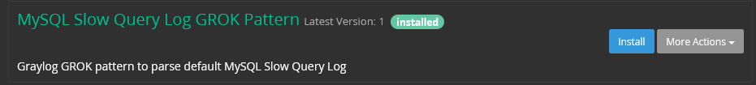
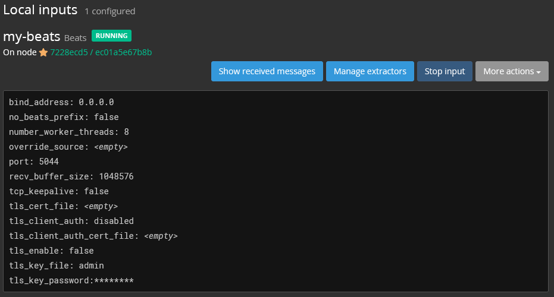
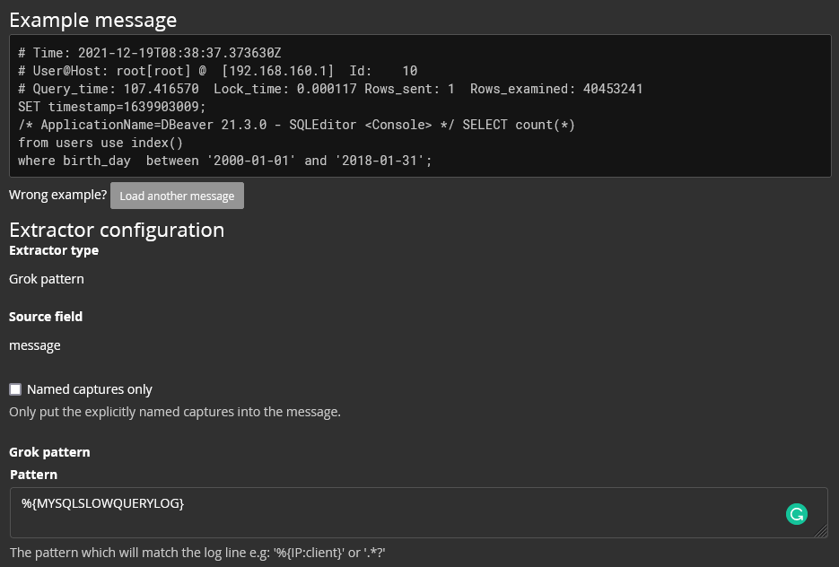
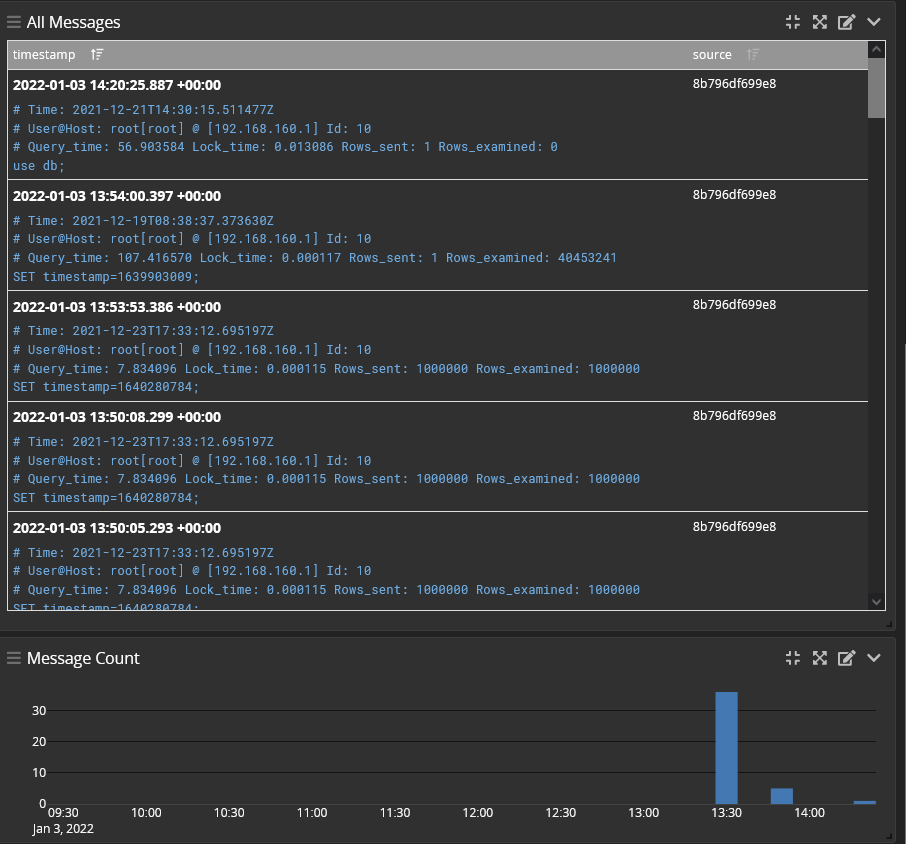

# Homework #15 for Highload:Projector

### Mysql Slow Query Log
- Set up MySQL with slow query log
- Configure ELK to work with mysql slow query log
- Configure GrayLog2 to work with mysql slow query log


Database optimization

## Installation

```
git clone https://github.com/god-of-north/highload-homework-15.git
cd highload-homework-15
docker-compose build
docker-compose -f docker-compose.graylog.yml build
```

#### Generate data for DB

```
docker-compose up
curl -X GET http://localhost:5050/add/100000
```

## Test ELK

To run slow query just call ```localhost:5050/slow```
```
curl -X GET http://localhost:5050/slow
```

Logstash will parse log and push it to ElasticSearch

MySql slow query log example
```
# Time: 2021-12-22T19:53:09.396136Z
# User@Host: root[root] @  [192.168.160.4]  Id:     8
# Query_time: 16.648223  Lock_time: 0.002175 Rows_sent: 1500000  Rows_examined: 1500000
use db;
SET timestamp=1640202772;
select * from users  Limit 1500000;
```

Logstash parse example
```
{
      "message" => "# Time: 2021-12-22T19:53:09.396136Z\n# User@Host: root[root] @  [192.168.160.4]  Id:     8\n# Query_time: 16.648223  Lock_time: 0.002175 Rows_sent: 1500000  Rows_examined: 1500000\nuse db;\nSET timestamp=1640202772;\nselect * from users  Limit 1500000;",
     "@version" => "1",
       "offset" => 8730,
    "rows_sent" => 1500000,
       "source" => "logs/slow.log",
 "current_user" => "root",
           "ip" => "192.168.160.4",
    "timestamp" => "1640202772",
        "query" => "select * from users  Limit 1500000;",
         "beat" => {
            "name" => "d7a86407865b",
        "hostname" => "d7a86407865b"
    },
         "user" => "root",
         "type" => "log",
   "input_type" => "log",
   "@timestamp" => 2021-12-22T19:53:09.488Z,
    "lock_time" => "0.002175",
"rows_examined" => 1500000,
   "query_time" => 16.648223,
         "tags" => [
        [0] "beats_input_codec_plain_applied"
    ]
}
```

Kibana dashboard example


## Test Graylog

### Running
To run the Graylog containers:
```
docker-compose -f docker-compose.graylog.yml up
```

### Setting Up

Open Graylog by the link http://localhost:9000/

Graylog creds:
- Login: **admin**
- Password: **password**

#### Install Content Pack

MySQL Slow Query Log GROK pattern for Graylog are taken from https://github.com/zionio/graylog_grok_mysqlslowquery

Upload it to System -> Content Packs


  


#### Add Inputs

Add the **Beats** input in System -> Inputs


  


Then add ```%{MYSQLSLOWQUERYLOG}``` pattern as Extractor


  


#### Test

To run slow query just call ```localhost:5050/slow```
```
curl -X GET http://localhost:5050/slow
```

  
